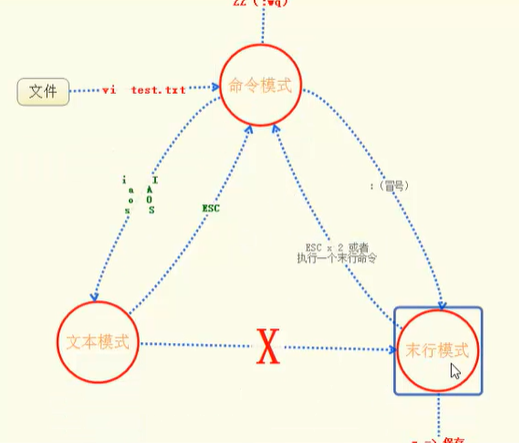
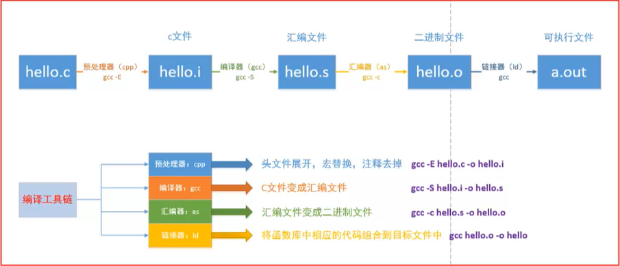

# 第一周

## 1. 基础命令

> - 文件和目录的创建
>
>   - 创建文件：touch 文件名
>   - 创建目录：mkdir 目录名
>
> - 文件和目录操作
>
>   - 查看目录内容：ls
>   - 进入目录：cd
>   - 删除目录：rmdir或rm -r
>   - 删除文件：rm 文件名
>   - 查看文件内容：cat 文件名
>
>   - 移动文件：mv 文件名 目录
>   - 重命名文件：mv 文件名 新文件名
>   - 拷贝文件：cp 文件名 目录

## 2. vim的使用

>
>
>* 命令模式
>   * 打开vim时就是命令模式
>   * 移动光标
>     - 左：j
>     - 右：l
>     - 下：j
>     - 上：k
>     - 移动到行首：0
>     - 移动到行尾：$
>     - 移动到文件的头部：gg
>     - 移动到文件尾部：G
>     - 移动到第500行：500G
>   * 删除操作（本质是剪切）
>     - 删除光标所在的字符：x
>     - 删除光标前面的字符：X
>     - 删除单词：dw
>     - 删除当前行光标前方所有内容：d0
>     - 删除当前行光标后方所有内容：d$或D
>     - 删除光标所在行：dd
>     - 定量删除当前行开始之后的行：ndd【n是指定的行数】
>     - 撤回操作：u
>   * 复制和粘贴
>     * 复制当前行：yy
>     * 复制多行：nyy
>     * 粘贴到下一行：p
>     * 粘贴到当前行：P
>     * 剪切 == 删除
>   * 可视模式
>     * 首先明确要操作的部分
>     * 将光标移动到该部分的开始或末尾
>     * 按v
>     * 移动光标，光标覆盖过的地方全部高亮显示
>     * 剪切选中部分：d
>     * 复制选中部分：y
>     * 粘贴到当前行：p
>   * 保存并退出：ZZ
>
>* 文本模式
>
>  * 从命令模式切换至文本模式
>    * i-------->在光标所在位置开始输入
>    * I-------->在行首输入
>    * a-------->光标后移一格输入
>    * A-------->在行尾输入
>    * o-------->在当前行下面新建一行输入
>    * O-------->在当前行上面新建一行输入
>    * s-------->删除光标后面的字符并开始输入
>    * S-------->删除光标所在行并开始输入
>
>* 末行模式
>
>  * 跳转到指定行 冒号 行数 例|：500
>
>  * 查找字符串
>
>    * 替换光标所在行：s/查找的内容/替换的内容/g      加了g会替换所有，不加则替换行首
>    * 替换文件所有行：%s/查找的内容/替换的内容/g      加了g会替换所有，不加则会替换每一行的行首
>    * 27,30s/查找的内容/替换的内容/g    替换27到30行选中的内容，g的作用同上
>
>  * 在末行模式执行命令：!具体命令
>
>  * 保存文件：w
>
>  * 退出：q
>
>  * 退出不保存：!q
>
>  * 保存并退出：wq
>
>    
>
>* 三种模式切换
>
>  >

## 3. gcc编译

>* gcc编译的4个阶段
>
>  > 
>
>* 一些参数

##  4. gdb调试

>

